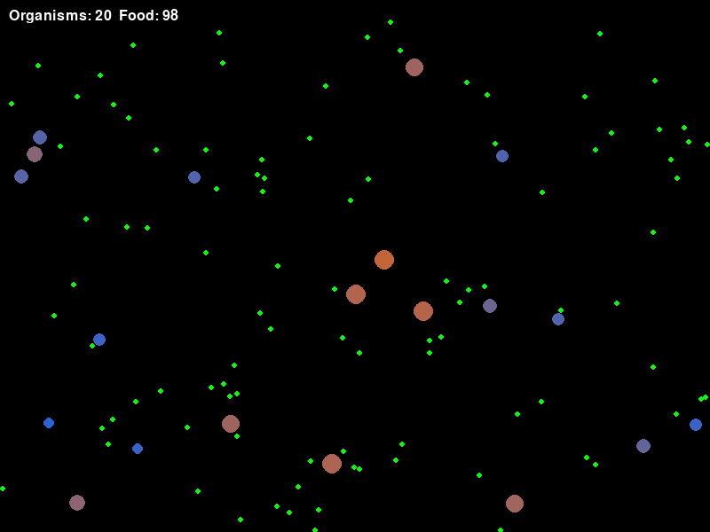

# Evolving Ecosystem Simulator



## Overview

The **Evolving Ecosystem Simulator** is a Python-based simulation that models simple evolutionary dynamics in a virtual ecosystem. In this simulation, digital organisms move around a virtual environment, searching for food. They gain energy by consuming food, lose energy over time due to metabolism, and reproduce when they accumulate enough energy. The simulation includes random mutations, allowing you to observe evolutionary changes in traits such as speed over time.

This project is built using Python and [Pygame](https://www.pygame.org/), with support for headless execution, making it suitable for environments like Google Colab.

## Features

- **Interactive Simulation:** Organisms autonomously search for food, gain energy, and reproduce.
- **Evolutionary Dynamics:** Traits like speed can mutate, demonstrating natural selection over time.
- **Visualization:** Organisms are color-coded by speed (red for faster, blue for slower), and food is displayed as green dots.
- **Headless Mode Compatibility:** Can run in headless mode, capturing frames to generate an animated GIF for visualization.

## Requirements

- Python 3.x
- [Pygame](https://www.pygame.org/)
- [pyvirtualdisplay](https://pypi.org/project/pyvirtualdisplay/) (for headless mode)
- [imageio](https://imageio.readthedocs.io/) (for GIF creation)
- [numpy](https://numpy.org/) (for handling frame data)

### Install Dependencies

Run the following command to install the necessary packages:

```bash
pip install pygame pyvirtualdisplay imageio numpy
```

If you are running this on Google Colab, you'll also need to install Xvfb:

```bash
!apt-get install -y xvfb
```

## Running the Simulation

### Locally

1. **Clone the Repository:**

   ```bash
   git clone https://github.com/mohiuddin-khan-shiam/Evolving-Ecosystem-Simulator.git
   cd Evolving-Ecosystem-Simulator
   ```

2. **Install Dependencies:**

   ```bash
   pip install pygame numpy imageio pyvirtualdisplay
   ```

3. **Run the Simulator:**

   ```bash
   python evolving_ecosystem_simulator.py
   ```

   This will open a Pygame window displaying the evolving ecosystem.

### On Google Colab (Headless Mode)

1. **Install Dependencies:**

   ```python
   !apt-get install -y xvfb
   !pip install pyvirtualdisplay imageio pygame numpy
   ```

2. **Run the Simulation:**

   Upload `evolving_ecosystem_simulator.py` to your Colab environment and execute the script. The simulation will run headlessly and generate an animated GIF (`simulation.gif`) displaying the ecosystem.

## How It Works

- **Organisms:** Each organism has traits such as position, speed, energy, and vision range. They search for food, move towards it, and consume it to gain energy.
- **Food:** Food items are randomly scattered across the environment. Organisms consume food when they come into contact with it.
- **Reproduction and Mutation:** When an organism's energy exceeds a certain threshold, it reproduces. Offspring inherit the parent's speed with a chance of mutation, leading to evolutionary changes.
- **Visualization:** Organisms are displayed as colored circles, where faster organisms appear redder, and slower ones appear bluer. Food is shown as small green dots.

## Customization

You can tweak various parameters in `evolving_ecosystem_simulator.py` to customize the simulation:

- `NUM_INITIAL_ORGANISMS`: Number of organisms at the start.
- `NUM_INITIAL_FOOD`: Number of food items initially present.
- `FOOD_ENERGY`: Energy gained from consuming food.
- `REPRODUCTION_ENERGY_THRESHOLD`: Energy required for reproduction.
- `MUTATION_RATE`: Probability of a mutation occurring during reproduction.
- `MUTATION_AMOUNT`: Range of possible mutation changes.

## Repository Contents

- **`evolving_ecosystem_simulator.py`**: The main simulation script.
- **`output.gif`**: Sample animated GIF showcasing the simulation.
- **`README.md`**: This file.

## License

This project is licensed under the MIT License. See the [LICENSE](LICENSE) file for more details.

## Acknowledgements

- Thanks to the developers of [Pygame](https://www.pygame.org/), [pyvirtualdisplay](https://pypi.org/project/pyvirtualdisplay/), and [imageio](https://imageio.readthedocs.io/) for providing the tools that made this project possible.

